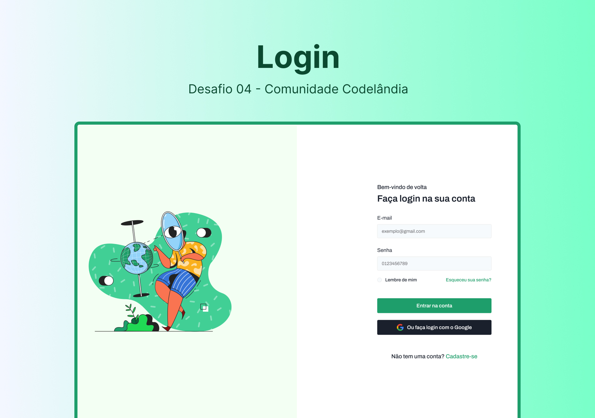

<h1 align="center">
  Login - Desafio 04
</h1>

  <a href="#rocket-sobre-o-desafio">Sobre o desafio</a>&nbsp;&nbsp;&nbsp;|&nbsp;&nbsp;&nbsp;
  <a href="#link-deploy">Deploy</a>&nbsp;&nbsp;&nbsp;|&nbsp;&nbsp;&nbsp;
  <a href="#art-layout">Layout</a>&nbsp;&nbsp;&nbsp;|&nbsp;&nbsp;&nbsp;
  <a href="#memo-licença">Licença</a>

 

## :rocket: Sobre o desafio

Reproduzir layout de uma página de login.

 

## :link: Deploy

Parar ter visualizar o projeto em produção é **[clicar aqui](https://login-desafio-04-codelandia.vercel.app/)**

 

### Nesse projeto foi utilizado

- **`NextJS`**

- **`Firebase`**

- **`Tailwind CSS`**

- **`Cookies`**

 

### Funções do projeto

- [x] Login por e-mail e senha. Favor utilizar (exemplo@gmail.com, 0123456789)
- [x] Login por conta Google
- [x] Rotas privadas
- [ ] Criar conta
- [ ] Esqueceu senha

 

## :art: Layout

Para acessar o layout do projeto no figma **[clique aqui](https://www.figma.com/file/Yb9IBH56g7T1hdIyZ3BMNO/Desafios---Codel%C3%A2ndia?type=design&node-id=4261%3A2&mode=design&t=Z5tSId4LLIJTEDnG-1)**

Layout desenvolvido por [Iuri Code](https://www.instagram.com/iuricode/)

 

## :memo: Licença

Esse projeto está sob a licença MIT. Veja o arquivo [LICENSE](../LICENSE) para mais detalhes.

---

Feito por [Lucas Samuel](https://github.com/lucassamuel94)
